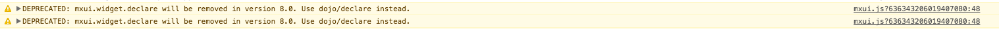

# Logging

Ever noticed the [logger.debug](https://github.com/mendix/AppStoreWidgetBoilerplate/blob/master/src/WidgetName/widget/WidgetName.js#L74) statements in a widget? They are there for a reason, logging and troubleshooting.

To view this, it is best to use Google Chrome and open the [Developer Tools](https://developer.chrome.com/devtools) (Menu -> More Tools -> Developer Tools). When opened, proceed to go to the tab 'Console'.

The logger object holds a few logging options, as well as log levels:

```js
{
  ALL:0,
  DEBUG:1,
  INFO:2,
  WARN:3,
  ERROR:4,

  debug : function (t){},
  error : function (t){},
  exception : function (t){},
  filter : function (t){},
  info : function (t){},
  level : function (t){},
  scream : function (t){},
  warn : function (t){},
}
```

Widgets in a Mendix application will emit messages on the browser console on various levels. Mostly these are warnings, for example for using deprecated API's:



## Custom widget logging

Most widgets will have the following statements at the beginning of method:

```js
  logger.debug(this.id + ".methodName");
```

The `this.id` corresponds to the widget ID. For example, if you use a LineChart, the ID will be `ChartJS_widgets_LineChart_widget_LineChart_XXX`. In this case `XXX` is a number that will increase.

We add the `methodName` to the logger statement, so we can see in the console which method is executed when.

## How do we show the logging?

Normally, the `logger.level` is set to `INFO` or `WARN`. The `logger.debug` statements do not show up. When you are developing/troubleshooting widgets, you want these debug statements to show up. There are two ways:

1. Add `logger.level(logger.DEBUG)` to your widget.
2. Use a userscript to set this in the browser while developing.

The first option, setting the level, is **NOT** recommended. The reason for this is that when you are publishing your widget, it is easy to forget to remove it. That means that any production app that uses this widget, will have a ton of logging in the Developer Tools. This might slow things down.

The second option is pretty simple:

- Install [TamperMonkey](https://chrome.google.com/webstore/detail/tampermonkey/dhdgffkkebhmkfjojejmpbldmpobfkfo?hl=en) for Google Chrome
- Add a new userscript for your locally deployed application, add [this userscript](https://gist.github.com/JelteMX/7c4b9e44c94f7e1a557e3c16665ebd39)

This will show you the logging everytime you are on `http://localhost:8080`. You can also change the `@match` value to match other URL's.
